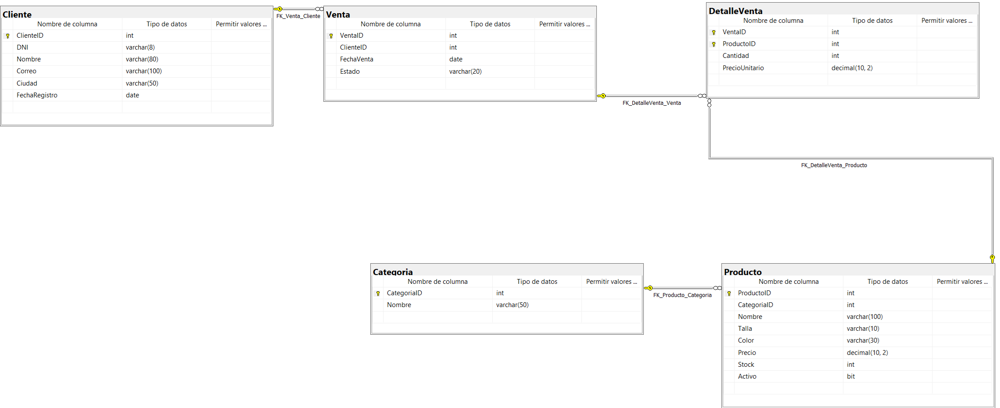

## Sistema de ventas e inventario para una tienda de ropa

## Integrantes

## Descripción

## Objetivo

## Desarrollo

## Solución propuesta

## Cómo ejecutar o revisar el proyecto

## Evidencias

### Diagrama de la base de datos

### Consultas básicas y sus resultados

**Búsqueda de productos con LIKE**

**Productos dentro de un rango de precios con BETWEEN**

**Filtro por estado de venta**

**Funciones de texto: UPPER, CONCAT y LEN**

**Funciones de redondeo: ROUND, CEILING y FLOOR**

**Funciones de fecha: DATEPART y DATEDIFF**

**Agregaciones: promedio, máximo y mínimo**

**Agrupación y filtro con HAVING**

## Conclusiones

## Video de exposición

Video público de YouTube:
